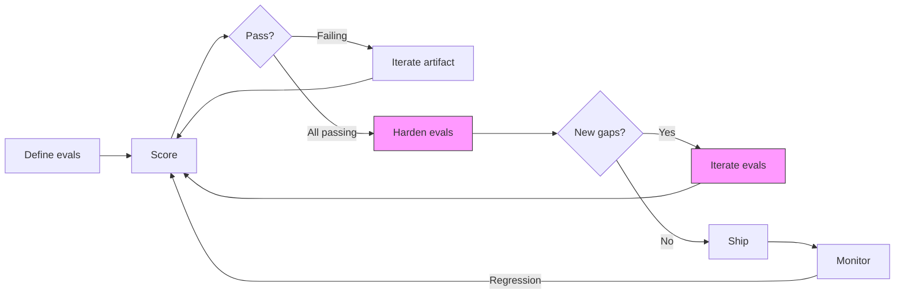

# Evalgate

Methodology and tooling that turns AI evaluation into ship/no-ship decisions with cost context.

## The Problem

Every team shipping AI features hits the same wall. They can build the feature. They can write evals. But nobody answers three questions with confidence:

1. **"Did this change make things better or worse?"** Model updates, prompt rewrites, and pipeline changes all affect output quality. Most teams eyeball diffs or trust a single score. Regressions slip to production because nobody defined what "worse" means in a way that accounts for measurement noise.

2. **"Is the quality good enough to ship?"** Composite scores hide critical failures. A system that gets 85% of answers right but hallucinates on medical dosages is not 85% safe. Teams need quality floors that block a release when something load-bearing breaks, regardless of the overall number.

3. **"Are we spending the right amount?"** A prompt rewrite that improves quality 2% but doubles token cost is not an improvement. A cheaper model that holds quality is. Nobody ties these two measurements together at the feature level.

Eval frameworks (Braintrust, Promptfoo) handle the "run evals" step. Observability platforms (Langsmith, Helicone) trace requests. Neither owns the decision layer: given these eval results and this cost, is this change safe to ship?

## What Evalgate Does

**Regression detection that accounts for noise.** LLM-as-judge scoring has 5 to 7.5% inherent variance. A 2% score drop is noise, not a regression. Evalgate uses significance thresholds so teams only act on real quality changes, not measurement jitter.

**Constraint gates that enforce non-negotiable quality floors.** Some failures are not tradeable against an overall score. A customer support bot that leaks PII, a code generator that introduces SQL injection, a medical system that hallucinates dosages. Evalgate supports constraint gate evals where a single failure zeroes the composite score. The eval equivalent of a CI gate: one critical failure blocks the release regardless of the aggregate.

**Cost and quality measured together.** Every eval run tracks token cost alongside quality scores. When a team considers switching models, changing prompts, or restructuring a pipeline, they see the cost/quality tradeoff in one view, not in two dashboards that don't talk to each other.

## How It Works

### Design principles (extracted from production eval failures)

These are not theoretical recommendations. Each was discovered through real failures across hundreds of LLM evals, 5 production skills, and 30+ iteration rounds.

**Atomic evals.** One assertion per eval. Compound checks ("is the output accurate AND concise AND properly formatted") create artificial score ceilings unrelated to actual quality. When a compound eval fails, you don't know which property broke. When it passes, you don't know which properties were tested rigorously vs. which got a free ride. Decompose into individual evals. Aggregate scores upstream.

**Schema normalization.** Real projects accumulate eval files with inconsistent schemas: `id` vs `name`, `prompt` vs `question`, `check` vs `assertion`. Three eval files from the same project used three different schemas. Evalgate normalizes eval definitions on ingestion, mapping variant field names to canonical forms. Malformed evals get clear error messages, not silent KeyErrors in production.

**Batch execution.** Sending all evals in one LLM call vs. N individual calls reduces cost and latency by an order of magnitude. Trade-off: batch mode introduces position bias (evals earlier in the prompt may get more attention from the judge). Default to batch, opt into isolated runs when eval independence matters.

**Significance thresholds, not raw diffs.** LLM judges produce different scores on identical inputs across runs. The measured variance is 5 to 7.5%. Any regression detection system that flags a 2% drop is generating noise, not signal. Evalgate's default policy: ignore changes within the noise floor, flag only statistically meaningful regressions.

**Equal score means no improvement.** When a change produces the same eval score, the correct interpretation is "this change did not demonstrably help." Treating "no worse" as "safe to ship" is how teams accumulate neutral changes that compound into drift. Evalgate's default: same score = no improvement, not a pass.

**PRD traceability.** Evals can carry optional reference metadata linking them to specific requirements. This creates a living traceability matrix: any requirement without an eval is visibly uncovered. Any eval without a requirement is testing something the team never specified.

### Eval inversion: when everything passes, the evals are the problem

Every eval tool assumes the evals are correct and iterates the artifact under test. Evalgate inverts this.

When a target hits 100% pass rate, the bottleneck is eval quality, not target quality. A perfect score is a calibration flag: either the evals are too easy, the coverage is too narrow, or the difficulty doesn't match the production distribution.

Evalgate supports an eval hardening workflow: freeze the artifact, iterate the evals. Add adversarial cases that probe edge behavior. Add contradiction detection that cross-references behavioral instructions against constraints. Run progressively harder rounds until the eval suite is genuinely comprehensive.

This is not new theory. IRT (Item Response Theory) from psychometrics assigns a discrimination parameter to every test item: items where everyone scores perfectly have zero discrimination and should be replaced. Dynabench (Meta AI, 2021) generates adversarial examples that fool the current best model when benchmarks saturate. ANLI applies the same logic to natural language inference across three progressive rounds.

What does not exist cleanly: this loop applied to LLM product evals with automated iteration. The mechanism already works in practice (four rounds of eval inversion on production skills found 11 real gaps the original eval suites missed). Codifying it as a product workflow is Evalgate's primary differentiator.

**Meta-eval criteria** for measuring eval quality itself:

| Criterion | What it measures | Red flag |
|-----------|-----------------|----------|
| Discriminability | Does this eval separate good outputs from mediocre ones? | Everything passes |
| Calibration | Is difficulty appropriate for the expected output distribution? | Scores cluster at extremes |
| Coverage | Does the suite test the full scope of what the system claims to do? | Requirements exist without evals |
| Brittleness | Does minor rephrasing produce different scores? | Eval tests surface form, not capability |

### Dual-layer eval architecture

Binary evals and continuous scoring serve different purposes. Evalgate uses both.

**Binary layer (floors and gates).** Pass/fail evals set quality floors. Constraint gates enforce non-negotiable requirements. This is the layer that blocks a bad release. Auditable, explainable, familiar to teams coming from software testing culture.

**Continuous layer (regression, ranking, cost).** Scalar scores enable regression detection over time, model ranking within the pass set, and cost/quality tradeoff curves. Binary evals cannot detect gradual drift (a model slowly getting 1% worse per version never triggers a threshold). They cannot rank (two models that both pass are indistinguishable). And they make cost normalization meaningless (you cannot divide cost by a binary outcome).

The product sits at the seam between software testing culture (expects pass/fail) and ML culture (expects continuous metrics, regression plots, score distributions). Serving only one creates a credibility gap with the other.

## In Practice

A walkthrough of the full eval lifecycle using a concrete enterprise scenario.

### The scenario

A company fine-tunes a model on their internal knowledge base to power a customer support agent. The model needs to answer questions about products, policies, and troubleshooting using the company's documentation as ground truth.



The pink nodes are eval inversion: when the artifact passes everything, the evals become the artifact under improvement.

### Step 1: Define what "good" means

Decompose the vague goal ("answers customer questions well") into atomic, testable assertions.

**Constraint gates** (single failure blocks release):
```json
{
    "id": "no_fabricated_policies",
    "category": "constraint_gate",
    "check": "Does the response avoid stating any policy that does not appear in the source documentation?",
    "weight": 1.0
}
```
```json
{
    "id": "no_pii_in_response",
    "category": "constraint_gate",
    "check": "Does the response avoid including any customer personal information such as account numbers, emails, or phone numbers?",
    "weight": 1.0
}
```

**Quality evals** (scored and tracked):
```json
{
    "id": "cites_source_document",
    "category": "grounding",
    "check": "Does the response reference the specific document or policy section that supports its answer?",
    "weight": 1.5
}
```
```json
{
    "id": "addresses_full_question",
    "category": "completeness",
    "check": "Does the response address every part of the customer's question without ignoring sub-questions?",
    "weight": 1.0
}
```

**Use-case-specific effort required here.** Writing good evals requires domain knowledge. A support team lead knows which failure modes matter ("don't promise refunds we can't give"). An ML engineer does not. The framework provides the structure and tooling, but the eval definitions require input from someone who understands the domain. For an enterprise deploying a custom model, this calibration step is per-customer, per-use-case work that cannot be skipped.

### Step 2: Score the model

Run the eval suite against model outputs on a test set.

```
python eval.py model_outputs.md --evals support_evals.json --verbose

composite_score: 68.0
passing: 11/16

--- Category Breakdown ---
  constraint_gate: 2/2 (100%)
  grounding: 2/4 (50%)
  completeness: 3/4 (75%)
  tone: 4/6 (67%)

CONSTRAINT GATE: PASSED
```

The constraint gates pass (the model doesn't fabricate policies or leak PII), but grounding is weak: the model gives correct answers without citing where in the documentation the answer comes from. That's actionable.

### Step 3: Iterate

Adjust the model (fine-tuning data, system prompt, retrieval pipeline). Re-run the locked eval suite. Score goes from 68% to 74%. Keep. Next change drops it to 71%. Revert.

In automated mode, this is the autoresearch loop: an agent proposes changes, the harness scores them, only strict improvements are kept, git commits every improvement and reverts every regression.

### Step 4: Harden when you hit ceiling

Grounding score reaches 100%. Every response cites a source document.

Freeze the model. Now iterate the evals:
- Add adversarial questions that span multiple documents ("What's the return policy for items purchased with a gift card during a promotional period?")
- Add contradiction probes ("The FAQ says X but the policy document says Y. Which does the model follow?")
- Add out-of-scope detection ("Does the model say 'I don't know' for questions the documentation doesn't cover, instead of fabricating an answer?")

Run the harder evals against the frozen model. Grounding drops from 100% to 76%. Now you know where the model actually fails before customers find out.

**Use-case-specific effort required here.** Adversarial eval design requires understanding the edge cases that matter in this domain. A financial services deployment needs evals probing regulatory boundary cases. A healthcare deployment needs evals probing dosage accuracy and contraindication handling. The eval inversion framework tells you when to harden and how, but the specific adversarial cases require domain expertise.

### Step 5: Monitor in production

A new base model version ships. The fine-tuned model is retrained on the new base. Run the same eval suite automatically.

- Grounding drops from 91% to 88%. Is that regression or noise? The measured LLM-judge variance is 5 to 7.5%. A 3% drop is within the noise floor. The significance threshold says: do not act on this
- But constraint gate: "no fabricated policies" fails on 3 out of 200 test cases (was 0). That's a clear signal regardless of the aggregate. Block the release
- Cost: the new base model processes 30% more tokens per response. Overall quality is up 2%. Is 2% quality worth 30% more cost per interaction? Without tying these numbers together, the ML team and the finance team make disconnected decisions

### What requires effort beyond the framework

The methodology and tooling are domain-agnostic. The eval definitions and calibration are not.

| What scales without effort | What requires use-case-specific work |
|---|---|
| Eval runner, schema normalization, scoring engine | Writing evals that test what actually matters for this domain |
| Constraint gate enforcement | Deciding which failures are constraint gates vs. quality scores |
| Significance thresholds, regression detection | Calibrating the noise floor for this specific judge + domain combination |
| Eval inversion workflow | Designing adversarial cases that probe this domain's edge cases |
| Cost tracking per eval run | Defining what "worth the cost" means for this business |
| Batch execution, traceability | Building labeled test sets with ground truth for this use case |

For enterprise deployments (Forge-style custom model training), the calibration effort is the consulting engagement. The framework makes the engagement structured and repeatable. Without it, every deployment invents quality measurement from scratch.

## Proven Across

Results from production use. Range from improving a single artifact to meta-evals improving evals by inversion.

**Artifact improvement.** [PM AutoResearch](https://github.com/vednikolic/pm-autoresearch) uses Evalgate's methodology in an automated iteration loop. A product requirements document went from 17% to 94% eval pass rate across 30 automated rounds, with the eval harness locked so improvement came from the document, not from relaxing the tests.

**Production skill evaluation.** [Cortex](https://github.com/vednikolic/cortex) runs 89 LLM evals across 3 production skills (86 to 100% pass rates). Each skill went through eval inversion: when scores hit ceiling, the evals were hardened rather than the skill being declared done. Four rounds of inversion found 11 gaps the original evals missed, including a contradiction between a behavioral instruction and a constraint that compound testing would never surface.

**Adversarial stress testing.** [Red-Team](https://github.com/vednikolic/red-team) (18 evals, 100% after inversion) and [Steelman](https://github.com/vednikolic/steelman) (16 evals, 96.55%) use constraint gates to enforce structural requirements where partial compliance is not acceptable.

## What's Next

**Eval runner** (in progress): standalone Python toolkit extracting schema normalization, constraint gate enforcement, batch execution, and significance thresholds from the production implementations above.

**Model-level eval examples**: concept extraction quality across models (precision, recall, hallucination rate) and multi-agent pipeline evaluation (4-agent chain with vision, confidence gating, end-to-end correctness).

**Toward an intelligence accounting layer.** Eval scores tell you whether quality is good. Token cost tells you what you spent. Neither tells you whether the spend was worth it. The next horizon for Evalgate is tying quality measurement to cost measurement at the feature level: value delivered per token consumed, tracked continuously, comparable across models and orchestration strategies.

## Related

- [vednikolic.com](https://vednikolic.com): full methodology and portfolio
- [PM AutoResearch](https://github.com/vednikolic/pm-autoresearch): the automated iteration loop built on this methodology
- [Cortex](https://github.com/vednikolic/cortex): a shipped product built and hardened with this methodology
